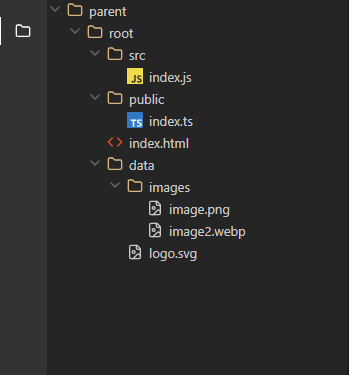
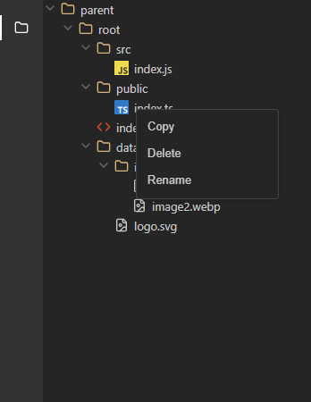

# File Explorer Component


A React component that replicates VS Code's file explorer sidebar functionality, built with React, TypeScript, and CSS.

## [Live Demo](https://attia-file-explorer.netlify.app/)



## Features

* VS Code-like file explorer interface
* Expandable/collapsible folders
* File selection with visual feedback
* Context menu for files (copy, delete, rename)
* Support for different file types with appropriate icons
* Responsive and animated transitions
* Built with TypeScript for type safety
* Comprehensive test coverage

## Context Menu


## Installation

```bash
# Clone the repository
git clone https://github.com/AhmedAtt/file-explorer

# Navigate to the project directory
cd file-explorer

# Install dependencies
npm install

# Start the development server
npm run dev
```

## Testing
```bash 
# Run tests
npm test

# Run tests with coverage
npm test -- --coverage
```


